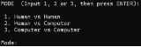
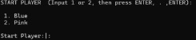
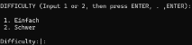
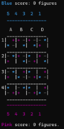
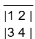
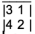
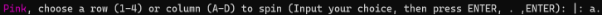
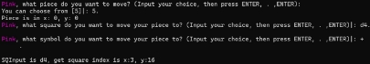
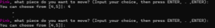

**Blütentanz**

**Topic and Group**

This project was developed by **Sara de Oliveira Cortez**, up202205636 and **Ana Beatriz Carneiro Ferreira**, up202205612, members of the group **Blütentanz\_1**. Many parts of the project were developed using pair-programming, which justifies the presence of a duplicate task in each members’ list.

Sara was responsible for 50 percent and performed the following tasks: Board features, spinning validation and mechanism, piece management, moving validation, mechanism, input loops, random difficulty, presentation, gamestate definition, score mechanisms, game loop, valuing.

Beatriz was responsible for 50 percent and performed the following tasks: movement mechanism, greedy algorithm difficulty, input sanitization, color integration, spinning mechanism, move validation.

**Installation and Execution**

In order to install the game, one must access our **src** folder by downloading and unzipping the provided **PFL\_TP2\_T11\_Blutentanz\_1.zip** zip folder. **Assuming that SICStus Prolog 4.9 is installed** in the machine, either the SICStus terminal can be opened or it can be started on the operating system’s own terminal. We strongly encourage the latter because it supports the display of different colors, which add much to the intuitiveness and appeal of our game, but it can run on the former without any problems. With SICStus started, one must simply insert the following command: **consult(‘[PATH TO game.pl INSIDE OF SRC FOLDER]’). .** Please make sure to either **escape the backward slashes** in the path by doubling them (\\) or **replace them with forward slashes** (/). Afterwards, simply type **play.** and hit enter, which will start the game.

**Description of the game**

**Blütentanz** is a board game traditionally played on a 4x4 board by two players. Each square has a moving piece containing, in clockwise order, a free space, an orange bloom, a grey bloom and a blue bloom. These symbols are replaced in our rendition by an empty space, a pink plus sign, a grey minus and a blue asterisk. At the start of each turn, a player has to **spin** all of the pieces in a row or column of their choice **clockwise**. Afterwards, they can make **3 moves**. They can only move their pieces on top of blooms of their color or grey blooms. They can **move one piece** up to three times or use their turn to **move up to three pieces**. A point is gained when a player’s piece reaches the **opposite end** of a board. The game is over when one player was able to successfully **move all of their pieces to the opposite side**.

Considerations for Game Extensions

Our **game logic** is fully **size-independent**. Our sample board has 16 squares, but could also have 25, or 36, or any **perfect square** number. However, when formatting the board to appear in the console, we only considered this 16 square logic, limiting the columns from A to D and the rows from 1 to 4. This logic can be altered to use ascii codes to cover a larger dimension switching from static display to dynamic. Using length(Board, L) we can count the number of squares, and then calculate the square root, Dim, attributing an A-Z, AA-ZZ for each unit of dimension. Adding the dimension field to the Gamestate term, we can use it to influence user input-validation and computer choices.

When it comes to rule expansion, a **novice player** might **skip the spinning step**, proceeding directly to the moves, or might be able to **spin both clockwise and counter-clockwise**, which would expand the ways in which one might be able to reach a tactical advantage quicker.

Some changes that could be made for a more **experienced player** would be limiting **spinning** to be **row or column exclusive**, which would restrict the chances for reaching an advantage point, or **limiting the type of moves that can be made in a turn** (only move different pieces or only moving one piece).

Game Logic

Game Configuration Representation

The game configuration is always represented inside of the GameState construct, which we will go deeper into in the following section. The game is configured in the beginning, by user input. The user will start by choosing one of the three game modes:

The first one requires two human players. After choosing this mode the user will be prompted for a Start Player. If he is on mode 2, computer vs machine, he will inst

The other two game modes involve at least one Computer player. The “intelligence” level of said player will be chosen in the next prompt, difficulty level:

**Difficulty 1**, Easy, will have the computer picking random moves from the valid ones available. **Difficulty 2**, Hard, will select the moves based on a greedy algorithm.

The GameConfig array, [Game Mode, Start Player, Difficulty], will then be passed to the **initial\_state/2** predicate which will return the first GameState, to be used in the first **game\_loop/1** call.

Internal Game State Representation

Our Board has an internal representation that differs significantly from the external one. The outer list is a list of the squares in the board. The inner lists are the squares,with indices ordered as depicted below. 

For instance, when a piece moves to an adjacent upper or lower square, its Y increases or decreases by 4. If the square is on the left, Y increases by 1. Depending on Y, a player might be able to go, from an X of 1, to an X of 3 or 2. So, when a square is spun, what happens to the list is not a list rotation. After a clockwise spin, a square [1,2,3,4] becomes [3,1,2,4]. 

This board has the symbols **-**, for **neutral** blossoms, **+**, for **pink** blossoms, and **\*** for **blue** blossoms. They are disposed on rows 1 to 4 and columns A to D. **Pink pieces** are represented **internally** as numbers from **0 to 4** and **blue pieces** are represented as numbers from **5 to 9**, **externally both can be seen as 1 to 5**. This provides an intuitive way for the player to move and keep track of their pieces.

Our **GameState** construct is composed of 10 fields:

- **Board**, containing the Board list. This list of lists, more specifically, the starting rotation of each square, is shuffled, randomly, at each state initialization. This way, the starting board is rarely twice the same.
- **Mode**
  - 1 - Human vs Human
  - 2 - Human vs Computer
  - 3 - Computer vs Computer
- **Difficulty**, only valid/checked when at least one of the players is a computer
  - 1 - Easy (Random moves)
  - 2 - Hard (Greedy Algorithm)
- **Current Player**
  - pink
  - blue
- **Current Piece**, integer representing the piece being moved, defaults to -1
- **Current Score Blue**, a list of the blue pieces that have reached the opposite end of the board
- **Current Score Pink**, a list of the pink pieces that have reached the opposite end of the board
- **Waiting Pieces Blue**, number of blue pieces that haven’t stepped the Board yet
- **Waiting Pieces Pink**, number of pink pieces that haven’t stepped the Board yet
- **Player Type**
  - bot
  - human

GameState examples:

**Initial**: [[Board],1,1,blue,-1,[],[],5,5,human] (All pieces are waiting, no piece selected) **Intermediate**: [[Board],3,2,pink,2,[9,8],[4,0],0,0,bot] (Some pieces have already scored) **Final**: [[Board],3,2,blue,-1,[9,8,7,6,5],[4,2,1],0,0,bot] (Blue won.)

Move Representation

A **move** is represented by a **tuple with two elements**, the final X and Y coordinates. The **move/3** predicate takes the **current GameState** and the **move** to be performed and **returns a NewGameState**. The move predicate **unpacks the move tuple** and gets the **current board** and the **piece to be moved** from **GameState**. It then fetches the **current coordinates of the piece** and performs the move by replacing and resetting the board in the relevant coordinates. The **board is updated** and a move call always ends by **checking for an update in the score**, as the move could have put the piece in a winning position. Another valid detail to mention is that, outside of **move/3** calls, moves can also be represented by a **tuple with three elements**, where the **piece to be moved is added**. This is useful when **returning all the valid moves** in a Game before a specific piece is selected and in **calculating move advantage** for the Greedy game difficulty. In a move, the state of the involved squares are saved, in order to alter just the positions contemplated.

User Interaction

As the initial game menu systems have already been displayed in the previous section, we will focus on our in-game input. When a human is playing, they will be asked to perform a spin. They have to **insert a column or row number**, and their **options are always displayed** along with the prompt:

In each move, the user will **pick a piece** from the available pieces to move, which are again **displayed** along with the prompt. They will also have to choose the **destination square** and **symbol**. Since Blutentanz rules say a player can play **up to** 3 times, we included a mechanism where the player can finish his turns before completing three moves.

In case of an **input syntax error**, the user will be **reprompted** so as to **avoid constant accidental game interruptions**.

Input interactions are mostly handled in a file named **io.pl.** Input is read inside of **catch** predicates in order to **smoothly deal with input syntax errors**. Aside from syntax errors, **input logic** is also checked, and the user will be reprompted in case of inconsistencies. Examples include verifying that **menu input is an integer** and is **contained inside of the displayed options**, verifying that **squares exist**, verifying if a **move is valid**, among other checks.

To every input, we ask the user to press Enter, then ‘.’, then Enter. This is because in our move input, we ask for a symbol (+, - or \*). In order for sicstus to interpret these as chars, a newline must be inserted. Despite not being necessary in the logic, we extended this request to the other inputs, for uniformization and simplicity of interaction.

`  `**Conclusions**

Throughout this project we were able to expand our Prolog skills. Applying the knowledge we collected through classes on a real, fully fledged game was the best way to consolidate what we had learned and allowed us to achieve an understanding of the nature of this programming language that we wouldn’t have reached otherwise. We managed to implement tail recursion when possible, and are especially proud of the coordination between a visually appealing and intuitive look with a much different internal logic. The complexity added by the spinning possibilities, as well as the move simulations in the greedy algorithm were challenging, and we are very happy with what we achieved.

`  `**Bibliography**

- Blütentanz tutorial and example gameplay video: [https://boardgamegeek.com/video/516375/blutentanz/blutentanz-como-se-juega-y-pa rtida](https://boardgamegeek.com/video/516375/blutentanz/blutentanz-como-se-juega-y-partida)
- Blütentanz rules (link provided in project specification): <https://boardgamegeek.com/boardgame/428363/blutentanz>
